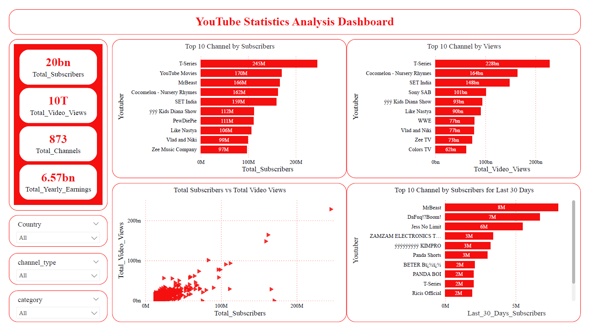
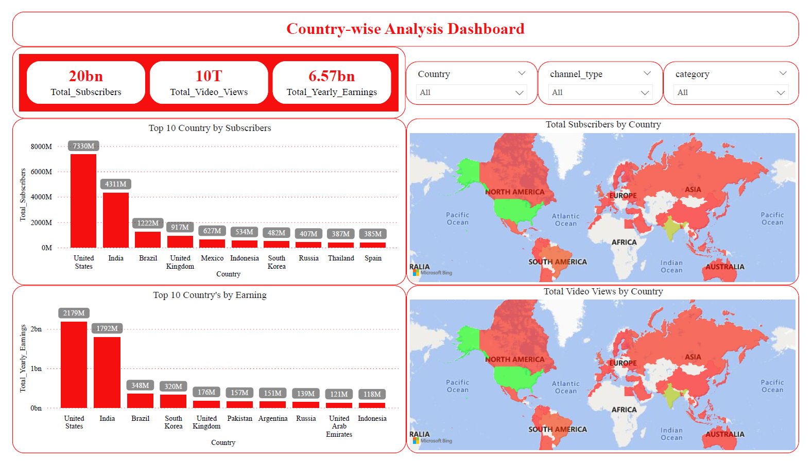

# 💡 Python & Power BI Project by Yash Yennewar

# 📊 YouTube Statistics Analysis | Python & Power BI
End-to-end analysis of global YouTube channel performance using Python for data cleaning and Power BI for interactive dashboards, uncovering insights on subscribers, views, earnings, countries, and channel types.

## 🔗 Project Link :

[YouTube_Statistics_Analysis](YouTube_Statistics_Analysis.pbix)
[Clean_Global_YouTube_Statistics](youtube_analysis.ipynb)

---

## 📌 Project Overview

This project presents a comprehensive analysis of global YouTube channel statistics by combining Python-based data cleaning with Power BI visual analytics.
It follows a real-world analytics workflow to extract meaningful business insights from raw data.

---

## Tools & Technologies Used
**Python**
- Pandas
- Numpy
- Jupyter Notebook

**Power BI**
- Power BI Desktop
- DAX Measures
- Interactive Dashboards & Reports

---

## 📂 Project Structure
```
YouTube-Statistics-Analysis/
│
├── youtube_analysis.ipynb
├── YouTube_Statistics_Analysis.pbix
├── images/
│   ├── youtube_dashboard.png
│   ├── country_analysis.png
│   ├── channel_type_report.png
│
└── README.md
```

---

## 🧹 Data Cleaning & Preparation (Python)
The dataset was first cleaned and prepared using Python to ensure high-quality data before visualization.
**Data Cleaning Steps:**
- Removed null and missing values.
- Fixed encoding and formatting issues.
- Converted numeric columns (Subscribers, Views, Earnings).
- Standardized categorical columns (Country, Category, Channel Type).
- Handled inconsistencies and outliers.

---

## 📊 Dashboards & Insights
### 1️⃣ YouTube Statistics Analysis Dashboard

**KPIs Included:**
- Total Subscribers
- Total Video Views
- Total Channels
- Total Yearly Earnings

**Visuals:**
- Top 10 Channels by Subscribers
- Top 10 Channels by Views
- Subscribers vs Video Views (Scatter Plot)
- Top Channels by Subscriber Growth (Last 30 Days)

**Insights:**
- Identifies top-performing YouTube channels globally.
- Shows relationship between subscribers and views.
- Highlights fast-growing creators.



---

### 2️⃣ Country-Wise Analysis Dashboard

**Visuals:**
- Top 10 Countries by Subscribers
- Top 10 Countries by Earnings
- Total Subscribers by Country (Map)
- Total Video Views by Country (Map)

**Insights:**
- United States and India dominate YouTube performance.
- Strong regional variation in content consumption.
- Earnings are highly concentrated in top countries.



---

### 3️⃣ Channel-Type Analysis Report

**Metrics Analyzed:**
- Total Subscribers
- Total Video Views
- Total Video Uploads
- Total Channels
- Total Monthly Earnings
- Total Yearly Earnings
- Subscribers Growth (Last 30 Days)

**Key Findings:**
- Entertainment and Music lead in subscribers and views.
- Education category shows strong impact with fewer channels.
- Gaming and People categories have high growth potential


---

## 📈 Key Business Insights
- Subscriber count has a strong correlation with total views
- Country dominance plays a major role in earnings
- Music and Entertainment are the most profitable categories
- Emerging channels can be identified using recent growth metrics

---

## 🎯 Use Cases
- Content creators can identify growth opportunities
- Brands can select influencers based on category and country
- Analysts can showcase real-world BI skills
- Businesses can understand global YouTube trends

---

## 🚀 Skills Demonstrated
- Data Cleaning & Preprocessing (Python)
- Exploratory Data Analysis (EDA)
- Data Modeling & DAX
- Interactive Dashboard Design
- Business Insight Generation
- End-to-End Analytics Workflow

---

## 📌 Future Enhancements
- Time-series trend analysis
- Engagement metrics (likes, comments)
- Predictive analytics for subscriber growth
- Automated data refresh pipeline
